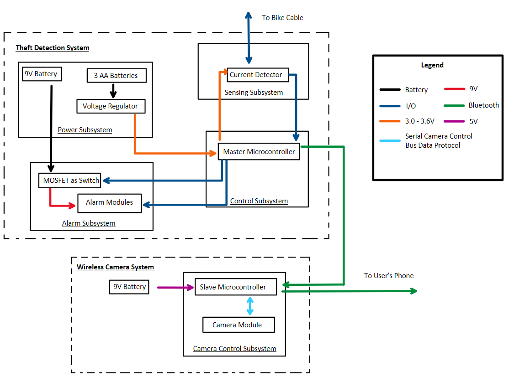
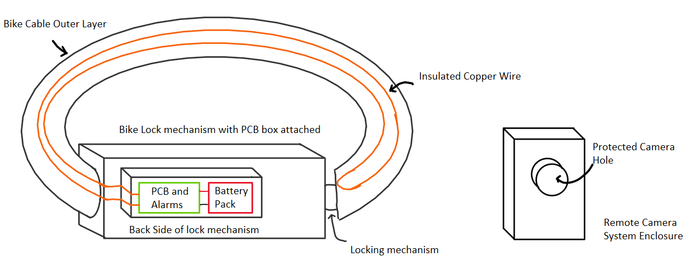
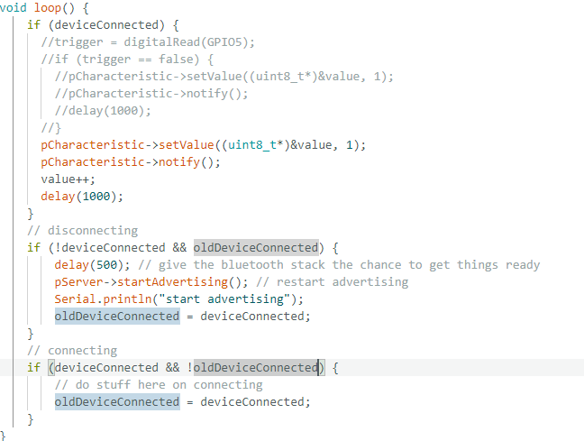
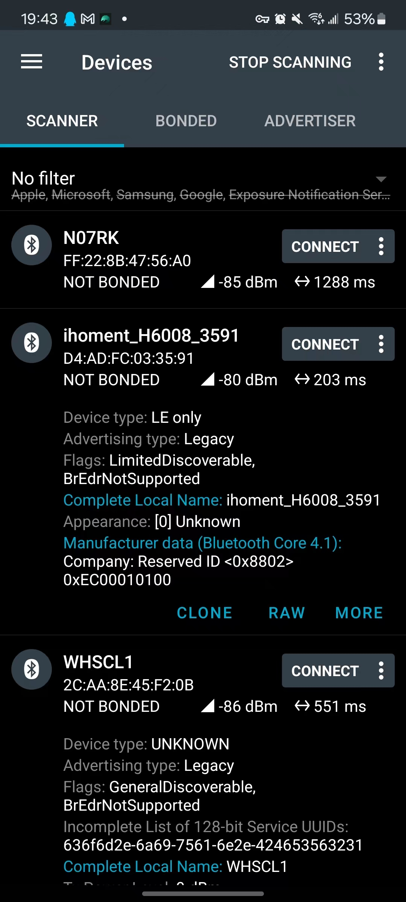
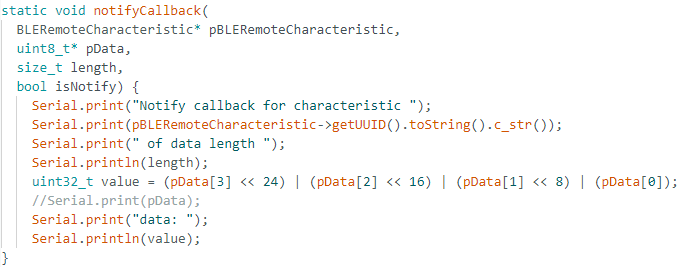
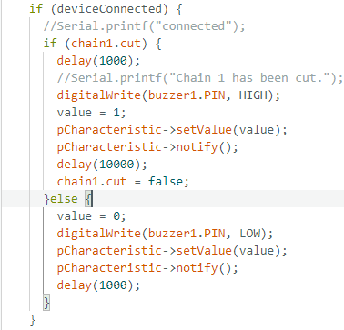
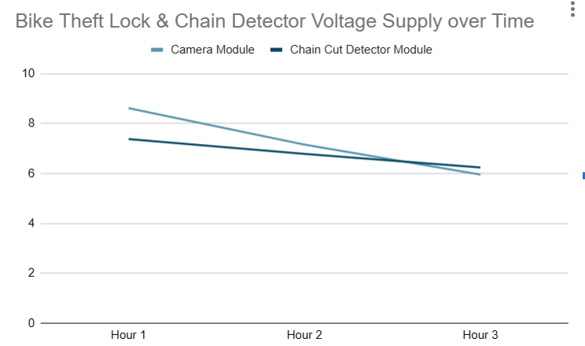
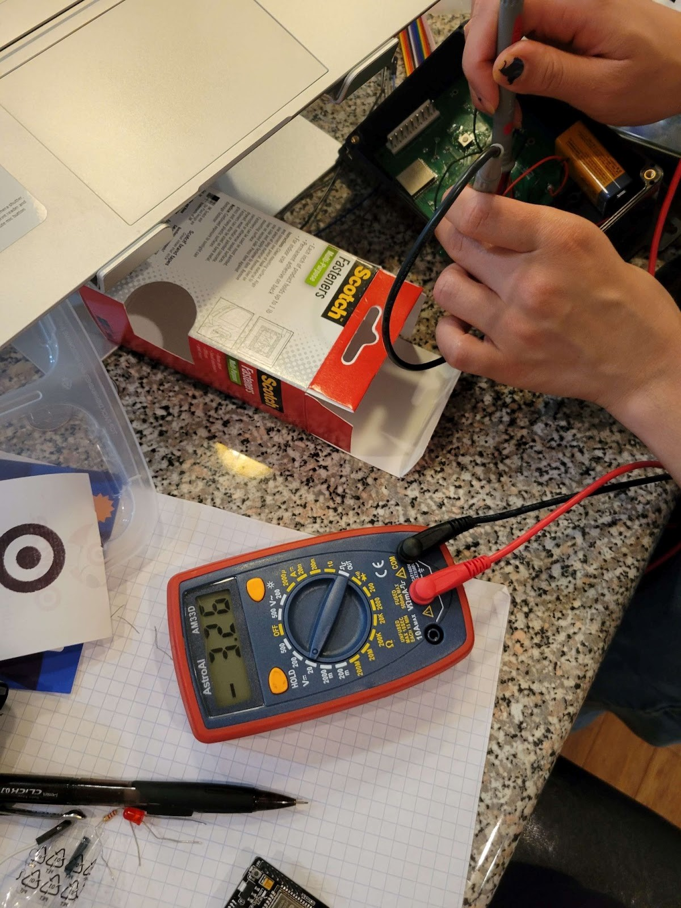

**Zhuoyuan Worklog**


___________________________________________________________________________________________________________________________________________________________________________________________________
**3/14/2024 Workload distribution**


In order to alert the bike user swiftly and provide important information about the thief, the proposed solution is a cable bike lock that detects when the cable is cut. A current will be passed through the cable and an open circuit will be detected by the microcontroller if the cable is cut. When the cable is cut, our cameras positioned on the cable and bike will record images that may potentially identify the criminal. The microcontroller will also send out a signal to trigger an alarm, as well as relay all this information to the user via bluetooth connection. The entire system serves to provide multiple layers of safeguards for the user’s bike. First, it deters theft attempts. Second, it alerts the public to a crime. Third, it captures evidence that can enable bike recovery. Here's the visual aid from proposal with the block diagrams:




I have interest and experience in coding, so I will focus on the software part of our porject. The bluetooth communication between two microcontroller and the bluetooth communication from esp32-CAM to the user phone. Nicki is focusing on dealing with the communication to user phone, so I will start to research on bluetooth communication between two microcontroller. We will do our own parts and I will integrate our code together. Jonathan will focus on pcb design.
__________________________________________________________________________________________________________________________________________________________________________________________________
**3/26/2024 Bluetooth communication**


It seems like nicki changed her mind to use WIFI module to communicate from esp32-CAM to user phone, but I can still use Bluetooth BLE for two chip communication. Bluetooth BLE should save more energy for communication comparing to WIFI communication between two phones.
I finish the coding of the server by adjusting the example from the ESP32C3 Dev Module's ESP32 BLE adruino library. I researched some online tutorial and only adjust the main loop of the library besides using a UUID from a UUID generator.



I used a app called nRF Connect to that can connect to esp32 bluetooth to receive the value of characteristic it sents once connected. I tested that the server can successfully send values now, after programming the code to esp32S3. We use a esp32 dev board to test the code since our pcb design aren't shipped and finished.


__________________________________________________________________________________________________________________________________________________________________________________________________
**4/2/2024 Bluetooth communication client**

I finished the coding of the client, or the esp32-CAM. I mainly adjust its callback function so that the value received can be shown on the seial monitor.



The value got was originally shown as a char, and I transfer it into an int, easier to verify.

The problem now was I faced some bug that the value got wasn't as expected: we expected value 1 sent by server if chain is cut, and 0 if not, but now the value kind of piles up somehow.
Also, I am thinking of passing value's value to a global variable to be used in the main loop, so that we can use that variable as an indicator of whether the chain is cut in client.

__________________________________________________________________________________________________________________________________________________________________________________________________
**4/4/2024 Bluetooth communication client continue**

I realized the value in characteristic sent by the client in main loop is value++, which is improper, so I changed it to stay in 1 when chain.cut is detected, and 0 otherwise. The client main loop can now utilize the value sent from the server and stored in variable name 'main_loop_value'.

Nicki has finished the code of the buzzer and the camera. I will work to integrate our code together now.

__________________________________________________________________________________________________________________________________________________________________________________________________
**4/7/2024 server intrgrated code**

Nicki has done the buzzer's code for the alarm subsystem in our design, so I integrate our code together successfully after testing and some debugging. The alarm now will trigger under two circumstances: when the wire is cut, and when the bluetooth is connected. Meanwhile, the server will stil send value to the client. 



I also tried to integrate the code of BLE client with the WIFI camera code Nicki wrote. Althought the pictures are taken, since we could see led flashlight on the camera module, there are some bugs that the connection to the user phone always shows unsuccessful, meaning the pictures are taken but not able to be sent to user phone. Nicki's code alone works fine in terms of sending pictures to user phone. We believe it might be a problem with her WIFI library's version, since she used 1.014 version of esp32 board from her tutorial and ,in the comment below, someone said the code in tutorial weren't working for latest esp32 board version. She is considering changing her tutorial to a later version of esp 32 board.

__________________________________________________________________________________________________________________________________________________________________________________________________
**4/10/2024 client intrgrated code**

Nicki changed her code to latest version of esp32 board, but the esp32-CAM are still not capable of sending the pictures. We realized after researches that the esp32-CAM only has 1 antenna, meaning if it's receiving bluetooth signal, it cannot send signal to user phone via WIFI.

I am thinking of how to disconnect the client from the server after client received signal indicating the wire is cut.
I searched online and found a way to deinitialzed the bluetooth for the client.
```
void loop() {

  //  Now we connect to it.  Once we are 
  // connected we set the connected flag to be true.
  if (doConnect == true) {
    if (connectToServer()) {
      Serial.println("We are now connected to the BLE Server.");
    } else {
      Serial.println("We have failed to connect to the server; there is nothin more we will do.");
    }
  //If the flag "doConnect" is true then we have scanned for and found the desired
  // BLE Server with which we wish to connect. 
    doConnect = false;
  }

  // If we are connected to a peer BLE Server, update the characteristic each time we are reached
  // with the current time since boot.
  if (connected) {
    String newValue = "Time since boot: " + String(millis()/1000);
    Serial.println("Setting new characteristic value to \"" + newValue + "\"");
    
    // Set the characteristic's value to be the array of bytes that is actually a string.
    pRemoteCharacteristic->writeValue(newValue.c_str(), newValue.length());
    //std::string value = pRemoteCharacteristic->readValue();
    //uint32_t received_value = (value[3] << 24) | (value[2] << 16) | (value[1] << 8) | (value[0]);
    Serial.print("The main_loop_value was: ");
    Serial.println(main_loop_value);
    
    if(main_loop_value == 1){
      sendPhoto = main_loop_value;
      BLEDevice::deinit();
      main_loop_value = 0;
    }
  }else if(doScan){
    //BLEDevice::getScan()->start(0);  // this is just example to start scan after disconnect, most likely there is better way to do it in arduino
    sendPhoto = false;
  }

  Serial.println(sendPhoto);
  if (sendPhoto) {
    Serial.println("Preparing photo");
    sendPhotoTelegram(); 
    delay(2000);
    sendPhotoTelegram();
    sendPhoto = false; 
  }
  if (millis() > lastTimeBotRan + botRequestDelay)  {
    int numNewMessages = bot.getUpdates(bot.last_message_received + 1);
    if (forceBoot == 1){
      forceBoot = 0;
      ESP.restart();
    }
    while (numNewMessages) {
          Serial.println("got response");
          handleNewMessages(numNewMessages);
          numNewMessages = bot.getUpdates(bot.last_message_received + 1);
    }
    lastTimeBotRan = millis();
  }
  delay(1000); // Delay a second between loops.
} // End of loop
```
If connected, the code will use if statement to detect whether main_loop_value, the value sent by the server, is 1, indicating the wire is cut. If it's 1, then the code:
```
if(main_loop_value == 1){
      sendPhoto = main_loop_value;
      BLEDevice::deinit();
      main_loop_value = 0;
    }
```
The line BLEDevice::deinit(); will deinitilze the BLE for client, causing it to disconnect from the server. Than we will pass this main_loop_value to sendPhoto, and reset main_loop_value to 0 for repeated test after resetting the client. The device can now trigger the alarm successfully, and send photos to user phones, but the pictures sent are somewhat purple, so Nicki is going to adjust parameters of the camera to fix this problem.

__________________________________________________________________________________________________________________________________________________________________________________________________
**4/17/2024 debugging overall intrgrated code using pcb and tried to add user stop**

During debugging of our code in the week, we fixed three bugs: 
1. The camera will take two photos even if we only ask it to take one.
2. After resetting the client for repeated test, the server will trigger the alarm and send value = 1 to client, indicating the wire is cut even if it's not.
3. The picture has a fine resolution and isn't that purple as before.

For the first bug, I originally thought maybe it's the line BLEDevice::deinit() in the original code that wasn't working properly, causing the connected variable which triggers the if statement of all bluetooth and camera module to be 1 even if it's no longer connected, causing the camera to take photos twice. I changed the BLEDevice::deinit() with a more comprehensive ways of disconnecting Bluetooth, this bug still happens since connected never return to 0 even if the disconnct program runs well. So, I just manually force the connect to zero after disbling the bluetooth connection, solving this problem.
```
if (connected) {
    String newValue = "Time since boot: " + String(millis()/1000);
    Serial.println("Setting new characteristic value to \"" + newValue + "\"");
    
    // Set the characteristic's value to be the array of bytes that is actually a string.
    pRemoteCharacteristic->writeValue(newValue.c_str(), newValue.length());
    //std::string value = pRemoteCharacteristic->readValue();
    //uint32_t received_value = (value[3] << 24) | (value[2] << 16) | (value[1] << 8) | (value[0]);
    Serial.print("The main_loop_value was: ");
    Serial.println(main_loop_value);
    
    if(main_loop_value == 1){
      sendPhoto = main_loop_value;
      esp_bluedroid_disable();
      esp_bluedroid_deinit();
      esp_bt_controller_disable();
      esp_bt_controller_deinit();
      connected = 0;
      main_loop_value = 0;
    }
    
  }else if(doScan){
    //BLEDevice::getScan()->start(0);  // this is just example to start scan after disconnect, most likely there is better way to do it in arduino
    sendPhoto = false;
  }

  Serial.println(sendPhoto);
  if (sendPhoto) {
    Serial.println("Preparing photo");
    sendPhotoTelegram(); 
    delay(2000);
    sendPhotoTelegram();
    sendPhoto = false; 
  }
```
I adjusted the code in if(main_loop_value == 1) statement.


For the 2nd bug, we found out that once the server disconnect from the client due to the client restart, we didn’t manually set the characteristic value to 0, the chain1.cut, which is a boolean value that indicate if the chain is detected to be cut, to false, and the digitalWrite(buzzer1.PIN, LOW), which gives a LOW output to the alarm. By failing to reset these parameters, the chain 1.cut is still 1, causing the server to mistakenly believe the chain is cut, and the HIGH output in digitalWrite causes the alarm to trigger. This problem is solved after changing the code for disconnection.
Nicki and I debugged the code together. We changed the server's code to form the lastest server code:
```
void loop() {
    if (deviceConnected) {
      //Serial.printf("connected");
      if (chain1.cut) {
        delay(1000);
        //Serial.printf("Chain 1 has been cut.");
        digitalWrite(buzzer1.PIN, HIGH);
        value = 1;
        pCharacteristic->setValue(value);
        pCharacteristic->notify();
        delay(10000);
        chain1.cut = false;
      }else {
        value = 0;
        digitalWrite(buzzer1.PIN, LOW);
        pCharacteristic->setValue(value);
        pCharacteristic->notify();
        delay(1000);
      }
    }
    // disconnecting
    if (!deviceConnected && oldDeviceConnected) {
        value = 0;
        chain1.cut = false;
        digitalWrite(buzzer1.PIN, LOW);
        delay(500); // give the bluetooth stack the chance to get things ready
        pServer->startAdvertising(); // restart advertising
        Serial.println("start advertising");
        oldDeviceConnected = deviceConnected;
    }
    // connecting
    if (deviceConnected && !oldDeviceConnected) {
        value = 0;
        chain1.cut = false;
        digitalWrite(buzzer1.PIN, LOW);
        // do stuff here on connecting
        oldDeviceConnected = deviceConnected;
    }
}
```
We mainly adjust the circumstances when the client disconnect from the server, or this block:
```
 if (!deviceConnected && oldDeviceConnected) {
        value = 0;
        chain1.cut = false;
        digitalWrite(buzzer1.PIN, LOW);
        delay(500); // give the bluetooth stack the chance to get things ready
        pServer->startAdvertising(); // restart advertising
        Serial.println("start advertising");
        oldDeviceConnected = deviceConnected;
    }
```
To reset the parameters like value and chain1.cut, and output LOW to the buzzer Pin.
Nicki solved the third bug by adjusting parameters.

We tried to add a functionality that the user are capable of stopping the alarm by typing "/reboot" in the chat bot of telegram and test it. Sometimes it functions well, sometimes it doesn't. We treid our best but couldn't figure out what's the reason for this inconsistency; thus, we decided to manually reset the esp32s3 by the button instead.
__________________________________________________________________________________________________________________________________________________________________________________________________
**4/20/2024 battery test, alarm decibel test, voltage test and preparing for demo presentation**

The code is working, the pcb is done and functioning after Jonathan and Nicki did some adjustment. Nicki worked on a button that shows battery life, and I did a battery test while preparing ffor demo presentation.

Jonathan had done a battery test with our esp32S3, which requires 3.3V operational voltage, but he didn't do the battery test for our camera module.
I just placed a new battery into the camera module, record its battery voltage supply every hour, and after 3 hours, I recorded the voltage of the battery for each hour to make a plot, and calculated the average voltage drop of the battery for esp32-CAM is 1.57, which is much larger than we expected.



In order to make sure all our subsystem satisfy our requirement, Nicki and I also did a alarm test to test the loudness of the alarm using an online application. The result is 91dB 5 feet away from the alarm, so it's much larger than we thought. We also did multiple voltage tests on our whole design:

voltage supply from esp32s3 to the wire we are detecting (3.3V):

voltage supplied to esp32S3 after regulator (3.3V):

voltage supplied to esp32-CAM after regulator (5V):

